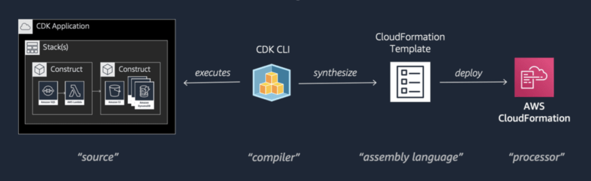
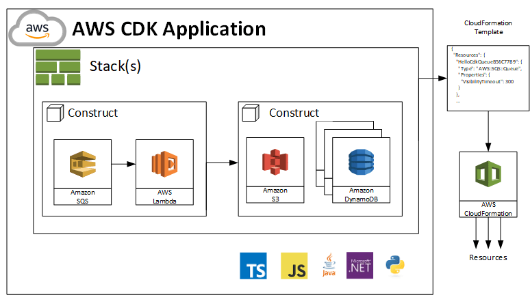

# AwsCdkWorkshop2023

# aws-infra

Nx with NPM workspace that manages AWS infrastructure and resource provisioning code (IaC)




## Prerequisites

Install AWS v2 CLI tool on OSX

> In the case you use a different operating system please check the reference https://docs.aws.amazon.com/cli/latest/userguide/getting-started-install.html

```
curl "https://awscli.amazonaws.com/AWSCLIV2.pkg" -o "AWSCLIV2.pkg"
sudo installer -pkg AWSCLIV2.pkg -target /
```

Check the installation succeed

```
which aws
/usr/local/bin/aws

aws --version
aws-cli/2.4.5 Python/3.8.8 Darwin/18.7.0 botocore/2.4.5
```

### Using both aws v1 and v2

Rename version 1 and install the new version

```bash
which aws
/usr/local/bin/aws

mv /usr/local/bin/aws /usr/local/bin/aws1

# then follow the steps of previous section
```

## AWS Configure CLI

```
aws configure 
➜  ~ aws configure
AWS Access Key ID [****************XXXXX]:
AWS Secret Access Key [****************+XXXXX]:
Default region name [us-east-1]:
Default output format [json]:
➜  ~

```

## Play with Simple Demo app 

```
cd packages/demo-app
npm run build
```
### Initilize AWS Account 

```javascript
const app = new cdk.App();
new DemoAppStack(app, 'DemoAppStack', {
  /* If you don't specify 'env', this stack will be environment-agnostic.
   * Account/Region-dependent features and context lookups will not work,
   * but a single synthesized template can be deployed anywhere. */

  /* Uncomment the next line to specialize this stack for the AWS Account
   * and Region that are implied by the current CLI configuration. */
  env: {
    account: process.env.CDK_DEFAULT_ACCOUNT,
    region: process.env.CDK_DEFAULT_REGION,
  },

  /* Uncomment the next line if you know exactly what Account and Region you
   * want to deploy the stack to. */
  // env: { account: '123456789012', region: 'us-east-1' },

  /* For more information, see https://docs.aws.amazon.com/cdk/latest/guide/environments.html */
});

```

```sh
export CDK_DEFAULT_ACCOUNT=XXXXXXX
export CDK_DEFAULT_REGION=us-east-1

```
## AWS-CDK Commands to deploy Stack

```sh
➜  demo-app git:(develop) ✗ npm run cdk-bootstrap       

> @tkssharma/demo-app@0.1.0 cdk-bootstrap
> cdk bootstrap

 ⏳  Bootstrapping environment aws://146050578321/us-east-1...


 ➜  demo-app git:(develop) ✗ npm run cdk-deploy   

> @tkssharma/demo-app@0.1.0 cdk-deploy
> cdk deploy


✨  Synthesis time: 2.33s

DemoAppStack: building assets...
 ```


## Understand this workspace

Run `nx graph` to see a diagram of the dependencies of the projects.

## Remote caching

Run `npx nx connect-to-nx-cloud` to enable [remote caching](https://nx.app) and make CI faster.

## Further help

Visit the [Nx Documentation](https://nx.dev) to learn more.
